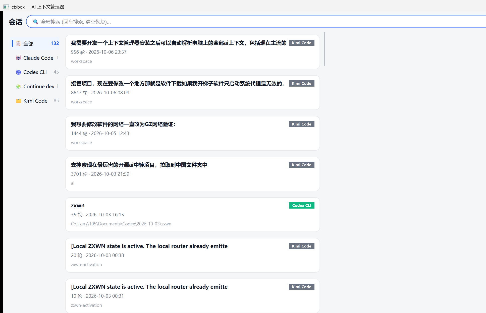
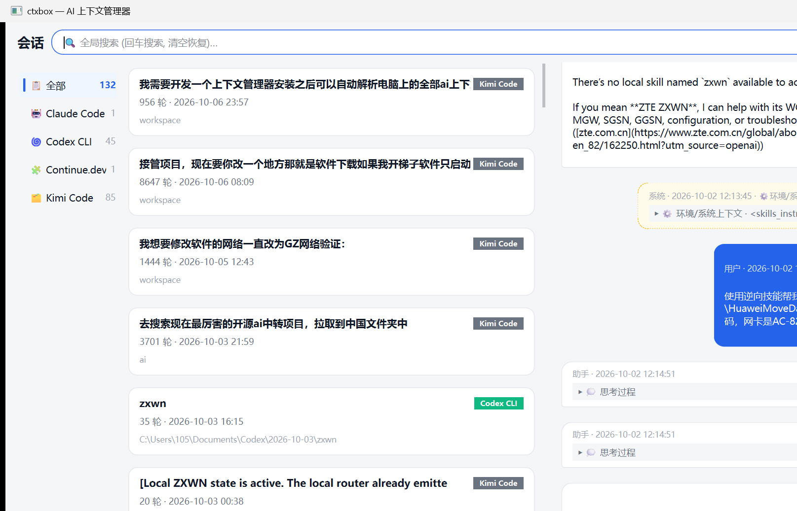

<div align="center">


# ctxbox

**One place for all your AI coding assistant contexts**
**一站式管理你电脑上所有 AI 编程助手的上下文**

[English](README.md) | [中文](README.zh-CN.md)

[](https://github.com/a2795751503/ctxbox/actions/workflows/ci.yml)
[](https://github.com/a2795751503/ctxbox/releases)
[](LICENSE)
[](https://www.python.org)
[](packaging/ctxbox.spec)



</div>

> **EN** — One place for all your AI coding assistant contexts. Scan, search, edit, copy, and inject conversation history across Claude Code, Codex, Cursor, Continue, Gemini CLI, Aider and more — 100% local, open source, MIT licensed.
>
> **中文** — 一站式管理你电脑上所有 AI 编程助手的上下文。自动扫描、搜索、编辑、复制 Claude Code、Codex、Cursor、Continue、Gemini CLI、Aider 等工具的对话记录，并可注入回原工具续聊 —— 100% 本地离线运行，开源，MIT 协议。完整中文文档见 [README.zh-CN.md](README.zh-CN.md)。

## Why ctxbox? / 为什么是 ctxbox？

**EN:** Your AI conversations are scattered across a dozen tools, each with its own opaque format (JSONL, SQLite, JSON, Markdown). ctxbox:

**中文：** 你的 AI 对话散落在十几个工具里，每家格式都不一样（JSONL、SQLite、JSON、Markdown），还有各种社区 fork 的"魔改"格式。ctxbox：

- **Discovers / 自动发现** — every supported tool's sessions on your machine automatically · 一键扫描本机所有支持工具的会话文件
- **Normalizes / 统一归一化** — one clean conversation model (user inputs vs. assistant outputs, tool calls, thinking blocks), even when the format is dirty, half-broken, or a community fork's flavor · 统一成干净的对话模型，输入输出一目了然；脏数据、半截行、魔改格式都能容错解析，绝不丢数据
- **Edit freely / 自由编辑** — modify any turn, delete, insert, reorder, clone, merge, find & replace, redact secrets · 改任意一轮提问或回答、删除、插入、排序、克隆、合并、查找替换、敏感信息一键脱敏
- **Injects back / 注入回去** — write a session as a brand-new native session file so the original tool can resume it, or migrate a Claude Code session into Codex · 写成原工具能识别的全新会话文件续聊，还能跨工具迁移（Claude Code → Codex）
- **Never touches originals / 绝不动原始文件** — atomic writes, automatic backups, one-click rollback · 原子写入、自动备份、一键回滚

## Supported tools

| Tool | Read | Inject back | Notes |
|---|:---:|:---:|---|
| Claude Code | ✅ | ✅ | JSONL sessions, uuid chain rebuilt |
| Codex CLI / Desktop | ✅ | ✅ | rollout JSONL with `session_meta` |
| Continue.dev | ✅ | ✅ | |
| Kimi Code | ✅ | ⚠️ export | wire.jsonl event logs |
| OpenCode | ✅ | ⚠️ export | opencode.db (SQLite, read-only) |
| Gemini CLI | ✅ | ⚠️ export | |
| Aider | ✅ | ⚠️ export | markdown history |
| Generic JSONL (forks, hand-rolled tools…) | ✅ | ✅ | fallback adapter |
| Cursor / Cline / Copilot / Windsurf | v0.4 | — | [planned](docs/adapters.md), adapter PRs welcome |

Want your tool here? [Adding an adapter takes ~100 lines](CONTRIBUTING.md#adding-a-new-adapter). PRs welcome!
想支持你的工具？[新增一个适配器只需约 100 行代码](CONTRIBUTING.md#adding-a-new-adapter)，欢迎 PR！

## Screenshots / 界面

<p align="center">

<br><em>对话时间线 — 蓝色为用户输入，白色为助手输出，黄色为折叠的环境上下文<br>Timeline — blue = user input, white = assistant output, amber = folded environment context</em>
</p>

## Install / 安装
Download the latest build for your OS from [Releases](../../releases), or run from source:
从 [Releases](../../releases) 下载对应平台的安装包，或从源码运行：

```bash
git clone https://github.com/a2795751503/ctxbox.git
cd ctxbox
pip install -e ".[gui]"
ctxbox-gui          # launch the desktop app / 启动桌面应用
```

## CLI / 命令行

Every GUI feature has a CLI equivalent: / GUI 的全部功能都有 CLI 等价命令：

```bash
ctxbox scan                     # discover & index all sessions / 扫描并索引全部会话
ctxbox list --tool claude-code  # list sessions / 列出会话
ctxbox show <session-id>        # print a conversation / 查看对话
ctxbox export <id> --format md -o out.md   # export / 导出
ctxbox inject <id> --to codex   # write as a new native session / 注入为原生新会话
```

## Privacy / 隐私

**EN:** ctxbox runs **entirely offline**. It never makes network requests with your data. Your conversations stay on your machine — the code is auditable, that's the point of open source.

**中文：** ctxbox **完全离线运行**，不会携带你的数据发起任何网络请求。你的对话只留在你自己的电脑上 —— 代码完全可审计，这就是开源的意义。

## Roadmap / 路线图

- [x] v0.1 — scan / search / edit / export / inject (Claude Code, Codex, Continue) · 扫描/搜索/编辑/导出/注入
- [ ] v0.2 — cross-tool injection, Cursor/Gemini/Aider adapters, token stats · 跨工具注入、更多适配器、token 统计
- [ ] v0.3 — MCP server mode, tray hotkey, adapter marketplace · MCP 服务、托盘热键、适配器市场

## Contributing / 参与贡献

**EN:** We love contributions — especially new adapters! See [CONTRIBUTING.md](CONTRIBUTING.md).

**中文：** 我们非常欢迎贡献 —— 尤其是新适配器！详见 [CONTRIBUTING.md](CONTRIBUTING.md)（中英双语）。

## License / 许可证

[MIT](LICENSE) © a2795751503 — 自由使用、修改、分发，欢迎二次开发。
