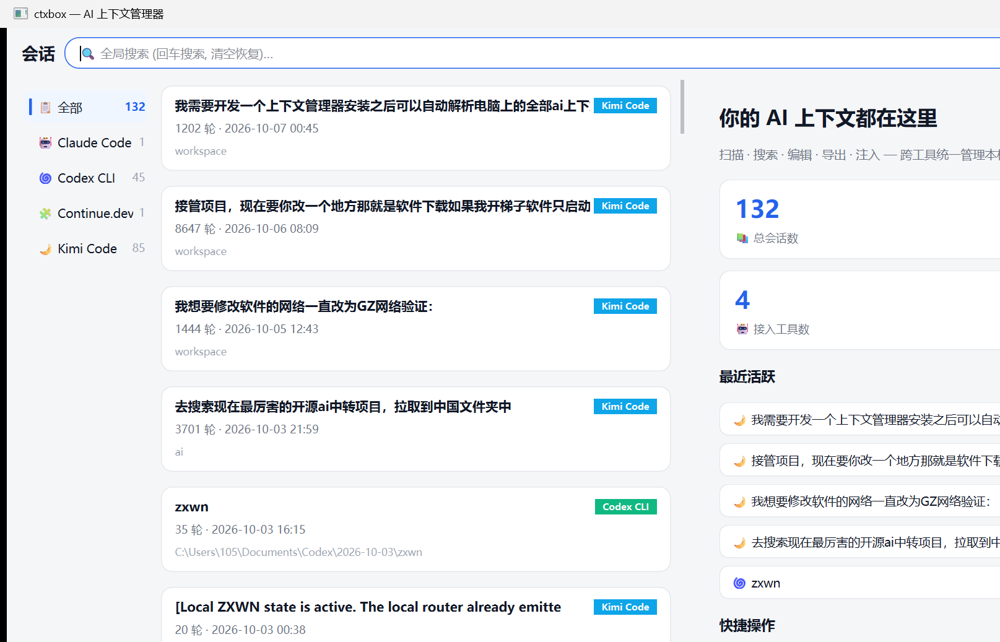

<div align="center">


# ctxbox

**一站式管理你电脑上所有 AI 编程助手的上下文**

[English](README.md) | [中文](README.zh-CN.md)

[](https://github.com/a2795751503/ctxbox/actions/workflows/ci.yml)
[](https://github.com/a2795751503/ctxbox/releases)
[](LICENSE)
[](https://www.python.org)
[](packaging/ctxbox.spec)



</div>

> 一站式管理你电脑上所有 AI 编程助手的上下文。自动扫描、搜索、编辑、复制、注入 Claude Code、Codex、Cursor、Continue、Gemini CLI、Aider 等工具的对话记录 —— 100% 本地运行，开源，MIT 协议。

## 为什么是 ctxbox？

你的 AI 对话散落在十几个工具里，每家格式都不一样（JSONL、SQLite、JSON、Markdown），还有各家社区 fork 的"魔改"格式。ctxbox：

- **自动发现**本机所有支持工具的会话文件
- **统一归一化**为干净的对话模型 —— 用户输入 vs 助手输出、工具调用、思考块一目了然；脏数据、半截行、编码混乱都能容错解析，绝不丢数据
- **自由编辑**：改任意一轮提问或回答、删除、插入、拖动排序、克隆、合并、全局查找替换、敏感信息一键脱敏
- **注入回去**：把会话写成原工具能识别的**全新会话文件**，打开原工具即可续聊；还能跨工具迁移 —— 把 Claude Code 的排错会话注入 Codex 继续干
- **绝不动原始文件**：原子写入、自动备份、一键回滚

## 支持的工具

| 工具 | 读取 | 注入回写 | 备注 |
|---|:---:|:---:|---|
| Claude Code | ✅ | ✅ | JSONL 会话，自动重建 uuid 链 |
| Codex CLI / Desktop | ✅ | ✅ | rollout JSONL，生成合法 session_meta 头 |
| Continue.dev | ✅ | ✅ | |
| Kimi Code | ✅ | ⚠️ 导出 | wire.jsonl 事件日志 |
| OpenCode | ✅ | ⚠️ 导出 | opencode.db（SQLite，只读） |
| Gemini CLI | ✅ | ⚠️ 导出 | |
| Aider | ✅ | ⚠️ 导出 | markdown 历史 |
| 通用 JSONL（各类 fork、自研工具） | ✅ | ✅ | 兜底适配器 |
| Cursor / Cline / Copilot / Windsurf | v0.4 | — | [计划中](docs/adapters.md)，欢迎适配器 PR |

想支持你的工具？[新增一个适配器只需约 100 行代码](CONTRIBUTING.md#adding-a-new-adapter)，欢迎 PR！

## 安装

从 [Releases](../../releases) 下载对应平台的安装包，或从源码运行：

```bash
git clone https://github.com/a2795751503/ctxbox.git
cd ctxbox
pip install -e ".[gui]"
ctxbox-gui          # 启动桌面应用
```

## 命令行

GUI 的全部功能都有 CLI 等价命令：

```bash
ctxbox scan                     # 扫描并索引全部会话
ctxbox list --tool claude-code  # 列出会话
ctxbox show <session-id>        # 查看对话
ctxbox export <id> --format md -o out.md
ctxbox inject <id> --to codex   # 注入为原生新会话
```

## 隐私

ctxbox **完全离线运行**，不会携带你的数据发起任何网络请求。你的对话只留在你自己的电脑上 —— 代码完全可审计，这就是开源的意义。

## 路线图

- [x] v0.1 —— 扫描 / 搜索 / 编辑 / 导出 / 注入（Claude Code、Codex、Continue）
- [ ] v0.2 —— 跨工具注入、Cursor/Gemini/Aider 适配器、token 统计
- [ ] v0.3 —— MCP server 模式、托盘热键、适配器市场

## 参与贡献

我们非常欢迎贡献 —— 尤其是新适配器！详见 [CONTRIBUTING.md](CONTRIBUTING.md)。

## 许可证

[MIT](LICENSE) © a2795751503
